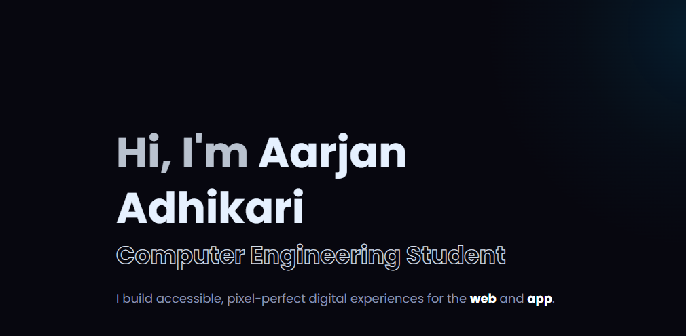

# 🌐 Aarjan Adhikari (V2)

Current portfolio site built from scratch to master the core principles of web layout and style systems.



---
## Installation

```bash
git clone https://github.com/AarjanAdhikari/portfolio.git

cd portfolio

npm install
```

## Development

```bash
npm run dev
```

Open http://localhost:3000

## Production

```bash
npm run build
npm run start
```

## Tech Stack

- Next.js
- React
- TypeScript
- Tailwind CSS
- Vercel

## Project Structure

```text
app/
components/
lib/
public/
styles/
```

## Scripts

```bash
npm run dev       # Start development server
npm run build     # Build for production
npm run start     # Start production server
npm run lint      # Run ESLint
```

## License

MIT © Aarjan Adhikari
